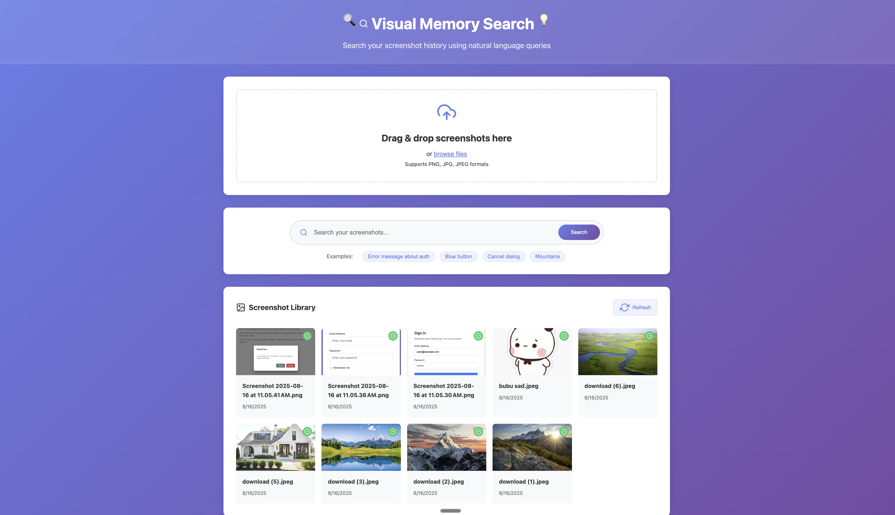
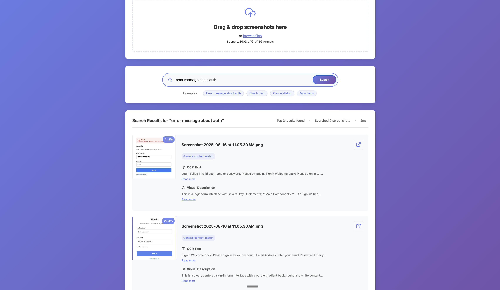
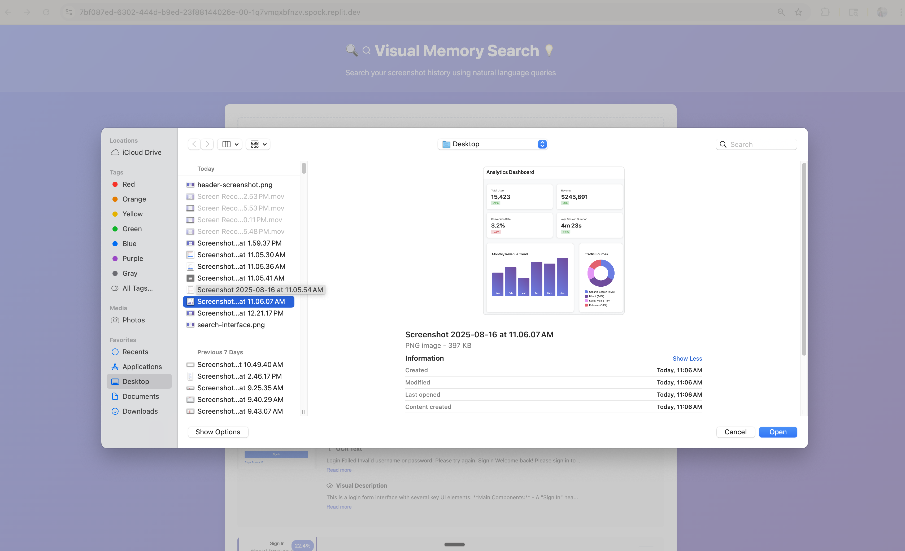
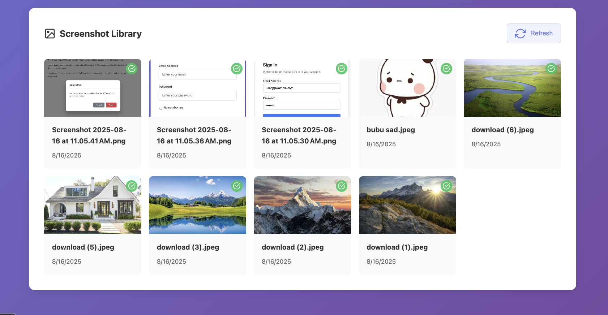

# Visual Memory Search 🔍

An intelligent screenshot search application that allows you to search through your screenshot history using natural language queries. Find your screenshots by describing what you're looking for, whether it's text content, UI elements, or visual features.


*Search your screenshots with natural language queries*

## 🌟 Features

### Core Functionality
- **Natural Language Search**: Search using everyday language like "error message about auth" or "screenshot with blue button"
- **Drag & Drop Upload**: Simple interface for uploading multiple screenshots at once
- **Smart Content Analysis**: Combines OCR text extraction with AI-powered visual descriptions
- **Real-time Processing**: Background processing with live progress updates
- **Responsive Design**: Works seamlessly on desktop and mobile devices

### Search Capabilities
- **Text Content Search**: Find screenshots containing specific text or error messages
- **Visual Element Search**: Locate screenshots with specific UI components, colors, or layouts
- **Hybrid Search**: Intelligent combination of text and visual similarity matching
- **Confidence Scoring**: Results ranked by relevance with confidence percentages


*Intuitive search interface with example queries*

## 🖥️ Screenshots

### Upload Interface

*Drag and drop interface with progress tracking*

### Search Results

*Detailed search results with confidence scores and matched elements*

### Screenshot Library

*Organized view of all uploaded screenshots with processing status*

## 🚀 Quick Start

### Prerequisites
- Python 3.11+
- Anthropic API key for visual descriptions (optional but recommended)

### Installation

1. **Clone or fork this Repl**
   ```bash
   # The project is ready to run on Replit
   ```

2. **Set up environment variables**
   - Add your `ANTHROPIC_API_KEY` in the Secrets tab (optional)
   - Without this, visual descriptions will be limited

3. **Run the application**
   - Click the "Run" button in Replit
   - The app will start on port 5000

4. **Access the application**
   - Open the preview window or visit your Repl's URL
   - Start uploading and searching your screenshots!

### Dependencies
The project uses these key libraries:
- **FastAPI**: Web framework for the backend API
- **Anthropic Claude**: AI-powered visual description generation
- **Tesseract OCR**: Text extraction from images
- **Sentence Transformers**: Semantic embeddings for search
- **SQLite**: Local database for metadata storage

## 🏗️ Architecture

### System Overview
```
┌─────────────────┐    ┌──────────────────┐    ┌─────────────────┐
│   Frontend      │    │    Backend       │    │   External      │
│   (Vanilla JS)  │───▶│   (FastAPI)      │───▶│   APIs          │
│                 │    │                  │    │   (Claude/OCR)  │
└─────────────────┘    └──────────────────┘    └─────────────────┘
                              │
                              ▼
                       ┌──────────────────┐
                       │   SQLite DB      │
                       │   + File Storage │
                       └──────────────────┘
```

### Core Components

#### Backend Services
- **ImageProcessor**: Handles OCR extraction and visual description generation
- **SearchService**: Performs intelligent hybrid search with content analysis
- **FileManager**: Manages file uploads, validation, and storage
- **DatabaseManager**: SQLite operations and data persistence

#### Frontend Features
- **Upload Zone**: Drag-and-drop file handling with progress tracking
- **Search Interface**: Natural language query input with example suggestions
- **Results Display**: Rich result cards with expandable content sections
- **Library View**: Grid layout of all screenshots with management controls

#### Database Schema
```sql
-- Screenshots table
CREATE TABLE screenshots (
    id TEXT PRIMARY KEY,
    filename TEXT NOT NULL,
    file_path TEXT NOT NULL,
    upload_date TIMESTAMP DEFAULT CURRENT_TIMESTAMP,
    processed BOOLEAN DEFAULT FALSE,
    ocr_text TEXT,
    visual_description TEXT,
    text_embedding BLOB,
    file_size INTEGER,
    image_width INTEGER,
    image_height INTEGER
);

-- Processing jobs table  
CREATE TABLE processing_jobs (
    job_id TEXT PRIMARY KEY,
    status TEXT CHECK(status IN ('processing', 'completed', 'failed')),
    progress INTEGER DEFAULT 0,
    total INTEGER,
    created_at TIMESTAMP DEFAULT CURRENT_TIMESTAMP,
    completed_at TIMESTAMP
);
```

## 🔍 How Search Works

### Intelligent Query Analysis
The search system analyzes your query to understand what type of content you're looking for:

- **Visual Queries**: "mountain pictures", "blue button", "error dialog"
- **Content Queries**: "authentication error", "login form", "cancel button"
- **Mixed Queries**: "screenshot with blue submit button"

### Multi-Stage Scoring
1. **Semantic Similarity**: Vector embeddings compare query meaning to screenshot content
2. **Content Type Matching**: Prioritizes relevant content types (UI vs. nature images)
3. **Text Matching**: Exact and partial matches in OCR text and descriptions
4. **Filename Analysis**: Smart filename parsing for additional context

### Example Searches
- `"error message about auth"` → Finds authentication error screenshots
- `"blue button"` → Locates UI screenshots with blue buttons
- `"mountain landscape"` → Returns nature/landscape images
- `"login form"` → Finds screenshots containing login interfaces

## 🛡️ Security & Privacy

### Data Protection
- **Local Storage**: All data stays on your Repl instance
- **No External Data Sharing**: Screenshots are never sent to third parties
- **Secure File Handling**: Validated uploads with size and type restrictions
- **API Key Security**: Environment variables for sensitive credentials

### File Safety
- **Type Validation**: Only PNG, JPG, and JPEG files accepted
- **Size Limits**: Maximum file size restrictions prevent abuse
- **Path Sanitization**: Secure file path handling
- **Error Boundaries**: Graceful handling of processing failures

### Processing Privacy
- **OCR Processing**: Text extraction happens locally using Tesseract
- **Visual Descriptions**: Only sent to Anthropic Claude if API key is provided
- **No Logging**: Search queries and personal data are not logged externally

## 🎯 Use Cases

### Development & QA
- Find specific error messages in bug reports
- Locate UI elements for design reviews  
- Search test screenshots by functionality
- Track visual changes across versions

### Documentation
- Organize screenshot libraries for tutorials
- Find specific app states for documentation
- Locate error examples for troubleshooting guides

### Personal Organization
- Search phone screenshots by content
- Find specific app interfaces or settings
- Locate receipts or important information in photos

## 🔧 Configuration

### Environment Variables
```bash
# Optional: For enhanced visual descriptions
ANTHROPIC_API_KEY=your_claude_api_key_here
```

### File Limits
- Maximum file size: 10MB per image
- Supported formats: PNG, JPG, JPEG
- Concurrent uploads: Up to 10 files at once

### Performance Tuning
- Images are automatically resized if larger than 2048px
- Vector embeddings cached for faster search
- Background processing prevents UI blocking

## 🚀 Deployment on Replit

This project is designed to run seamlessly on Replit:

1. **Automatic Dependencies**: All packages install automatically
2. **Zero Configuration**: No additional setup required
3. **Persistent Storage**: SQLite database and uploads persist between runs
4. **Environment Secrets**: Use Replit's Secrets tab for API keys
5. **Always-On**: Enable Always-On for 24/7 availability (Hacker plan)

### Scaling Considerations
- SQLite suitable for personal/small team use
- File storage scales with Replit storage limits
- Consider PostgreSQL for high-volume production use

## 🤝 Contributing

### Development Setup
1. Fork this Repl
2. Make your changes
3. Test thoroughly with various screenshot types
4. Submit improvements via Replit's collaboration features

### Areas for Enhancement
- **Advanced Filters**: Date ranges, file types, confidence thresholds
- **Batch Operations**: Multi-select and bulk actions
- **Export Features**: Search results export and backup
- **UI Improvements**: Dark mode, accessibility features
- **Search Analytics**: Query history and usage statistics

## 📝 License

MIT License - Feel free to use this project for personal or commercial purposes.

## 🙏 Acknowledgments

- **Anthropic Claude**: AI-powered visual understanding
- **Tesseract OCR**: Open-source text recognition
- **Sentence Transformers**: Semantic search capabilities
- **FastAPI**: Modern Python web framework
- **Replit**: Development and hosting platform

## 🐛 Troubleshooting

### Common Issues

**Search returns no results:**
- Ensure screenshots are fully processed (green checkmark in library)
- Try different query phrasings
- Check that uploaded images contain the content you're searching for

**Upload failures:**
- Verify file format is PNG, JPG, or JPEG
- Check file size is under 10MB
- Ensure stable internet connection

**Slow processing:**
- Large images take longer to process
- OCR processing depends on text complexity
- Visual descriptions require API calls (if enabled)

**Getting Started:**
- Upload a few test screenshots first
- Try the example queries to understand capabilities
- Start with simple, descriptive search terms

---

**Built with ❤️ on Replit** | [View Live Demo](your-repl-url-here) | [Fork This Project](your-repl-url-here)
